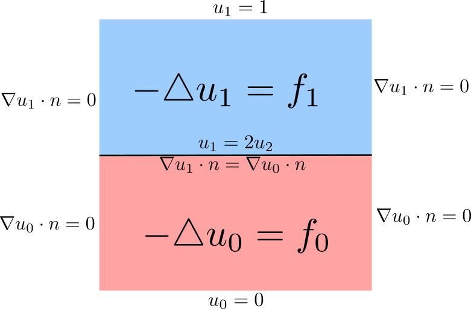

**************
Linear Problem
**************

Problem Description
###################

Let us consider square domain divided into two parts. We will solve laplace
equation in both parts of the domain. We prescribe standard boundary conditions
on the sides od the domain (see the figure below). Moreower, it is necessary to
set the interace conditions.

We can write the weak formulation in the following form.

.. math::

    \int_{\Omega_1} \nabla u_1 \nabla \varphi_1 \;dx 
    - \int_{\Gamma} (\nabla u_0 \cdot n) \varphi_1 \;ds \quad \forall \varphi_1 
    \in W^{1,2}_{\Omega}; \; \psi = 0 \text{ on top } \}

.. math::

    \int_{\Omega_0} \nabla u_0 \nabla \varphi_0 \;dx \quad \forall \varphi_0 \in
    \{ \psi : W^{1,2}_{\Omega}; \; \psi = 0 \text{ on bottom and at } \Gamma \}

Implementation
##############

For this example we will need to import LinearInterfaceSolver and interface.
::

    from InterfaceSolver import LinearInterfaceSolver
    from InterfaceSolver import interface

We load the mesh and we build marks on subsets. Moreover we will crate a Measure
dX, which takes into acount the subdomains.

::

    mesh = Mesh("mesh/mesh.xml")
    marker = MeshFunction("size_t", mesh, mesh.topology().dim(), 0)
    # mark cells ... 1 bottom ; 0 top
    for c in cells(mesh):
        marker[c] = c.midpoint().y() < 0.5

    dX = Measure("dx")(domain=mesh, subdomain_data=marker)

Then we label parts of the boundaries.

::

    # boundary
    top =  CompiledSubDomain("near(x[1], top) && on_boundary", top = 1.0)
    bottom = CompiledSubDomain("near(x[1], bottom) && on_boundary", bottom = 0.0)
    middle = CompiledSubDomain("near(x[1], middle) ", middle = 0.5)

    bcb = DirichletBC(V, Constant(0.0),bottom)
    bct = DirichletBC(V, Constant((1.0)), top)
    bcm = DirichletBC(V, Constant((0.0)), middle)

Further we need to create function spaces and functions similarly as in FEniCS.

::

    # function space
    V = FunctionSpace(mesh,'CG',1)
    v = TestFunction(V)
    u = TrialFunction(V)
    sol = Function(V)

We label the interface facets boundary. We use for that function interface, but
it can be done in a different way.

::

    def interface_func(x, y):
        return y-0.5
    interface_marker = interface(mesh, interface_func, val=1)

We will define UFL forms

::

    # right-hand side
    a1 = inner(grad(u), grad(v))*dX(1) # bottom
    a0 = inner(grad(u), grad(v))*dX(0) # top
    
    # left hand side
    f1 = Expression('exp(-(x[0]-0.5)*(x[0]-0.5)-(x[1]-0.5)*(x[1]-0.5) )', degree=2)
    l1 = 10.0*f1*v*dX(1)

    f0 = Expression('exp(-(x[0]-0.5)*(x[0]-0.5)-(x[1]-0.5)*(x[1]-0.5) )', degree=2)
    l0 = -10.0*f0*v*dX(0)

For solving the problem, the class LinearInterfaceSolver has to be initialised.
Afterwards the we will call method solve.

::

    # solve
    solver = LinearInterfaceSolver(
        sol, marker, interface_marker, interface_value=1, cell_val=0)

    solver.solve(a0, a1, a_interface, l0=l0, l1=l1, l_interface=None,
             bcs0=[bct], bcs1=[bcb], bcs_zero1=[bcm])

Then the result can be stored

::

    # save and plot
    sol.rename('u','u')
    with XDMFFile(comm,"{}/{}.xdmf".format('.','u') ) as xdmf:
        xdmf.parameters["flush_output"] = True
        xdmf.parameters["functions_share_mesh"] = True
        xdmf.write(sol)