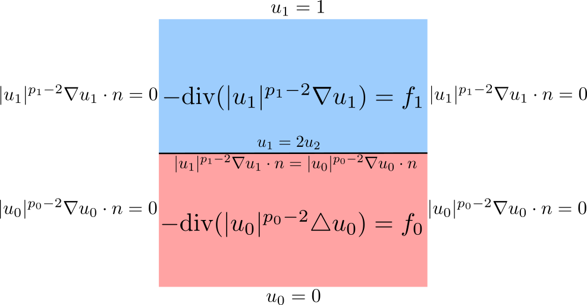

*****************
Nonlinear Problem
*****************

Problem Description
###################

Let us consider square domain divided into two parts. We will solve laplace
equation in both parts of the domain. We prescribe standard boundary conditions
on the sides od the domain (see the figure below). Moreower, it is necessary to
set the interace conditions.

We can write the weak formulation in the following form.

.. math::

    \int_{\Omega_1} |u_1|^{\frac{p_1-2}{2}}\nabla u_1 \nabla \varphi_1 \;dx 
    - \int_{\Gamma} (|u_0|^{\frac{p_1-2}{2}} \nabla u_0 \cdot n) \varphi_1 \;ds \quad \forall \varphi_1 
    \in W^{1,2}_{\Omega}; \; \psi = 0 \text{ on top } \}

.. math::

    \int_{\Omega_0} \nabla u_0 \nabla \varphi_0 \;dx \quad \forall \varphi_0 \in
    \{ \psi : W^{1,2}_{\Omega}; \; \psi = 0 \text{ on bottom and at } \Gamma \}

Implementation
##############

First we need to import NonlinearInterfaceSolver and interface.
::

    from InterfaceSolver import NonlinearInterfaceSolver, interface

We will import the mesh and lablel the subdomains
::

    mesh = Mesh("mesh/mesh.xml")

    # label the top and the bottom subdomains
    marker = MeshFunction("size_t", mesh, mesh.topology().dim(), 0)
    for c in cells(mesh):
        marker[c] = c.midpoint().y() > 0.5

We set the cell value which corresponds to "-" sign.
::

    cell_val = 0 # bottom
    top_sign = '-'
    bottom_sign = '+' # plus corresponds to the cell val

The function spaces and functions
::

    V = FunctionSpace(mesh, 'CG', 2)

    v = TestFunction(V)
    u = Function(V)

Boundaries and Dirichlet boundary conditions.
::

    top =  CompiledSubDomain("near(x[1], top) && on_boundary", top = 1.0)
    bottom = CompiledSubDomain("near(x[1], bottom) && on_boundary", bottom = 0.0)
    middle = CompiledSubDomain("near(x[1], middle) ", middle = 0.5)

    bcb = DirichletBC(V, Constant(0.0), bottom)
    bct = DirichletBC(V, Constant((1.0)), top)
    bcm = DirichletBC(V, Constant((0.0)), middle)

Then we label interface and define measure on subdomains.
::

    def interface_func(x, y):
        return y-0.5

    interface = interface(mesh,interface_func, val=1)
    dX = Measure("dx")(domain=mesh, subdomain_data=marker)

We formulate UFL forms.

::
    
    def gamma(u, p, epsilon=1.0e-7):
        value = (epsilon**2 + inner(grad(u), grad(u)) )**((p - 2 ) / 2 )
        return value

    p0 = 1.8
    p1 = 2.1
    n = Constant((0., 1.)) # normal vector

    Tn = gamma(u(top_sign), p1)*inner(grad(u(top_sign)) ,n)
    a_interface = (
        inner(( u(bottom_sign) - 2*u(top_sign)),v(top_sign))*dS
        + 1.0*inner(Tn,v(bottom_sign))*dS
    )

    a1 = inner(grad(v), gamma(u, p1)*grad(u))*dX(1)
    a0 = inner(grad(v), gamma(u, p0)*grad(u))*dX(0)
    # right-hand side
    f1 = Expression('exp(-(x[0]-0.5)*(x[0]-0.5)-(x[1]-0.5)*(x[1]-0.5) )', degree=2)
    l1 = 10.0*f1*v*dX(1)
    a1 += l1

    f0 = Expression('exp(-(x[0]-0.5)*(x[0]-0.5)-(x[1]-0.5)*(x[1]-0.5) )', degree=2)
    l0 = -10.0*f0*v*dX(0)
    a0 += l0

We initialize the solver and solve the system. We would like to use the
discontinuous part of the interface conditions as Dirichlet boundary
conditions, so we need to remove everything from the degrees of freedom,
before we assemble the interface. This can be done by setting bcs_zero1 = [bcm]
which removes everything from the interface corresponding to form a1 - the form
on the top. 
::

    # solve
    Solver = NonlinearInterfaceSolver(
        u, marker, interface, interface_value=1, cell_val=cell_val, params=None)

    Solver.solve(a0, a1, a_interface,
                bcs0=[bct], bcs1=[bcb], bcs_zero0=[], bcs_zero1=[bcm])

Save and plot the results.
::

    # save and plot
    directory = 'results/nonlinear_parabolic'
    with XDMFFile(comm,f"{directory}/u.xdmf" ) as xdmf:
        xdmf.parameters["flush_output"] = True
        xdmf.parameters["functions_share_mesh"] = True
        f = xdmf
        
    u.rename('u','u')
    f.write(u)
