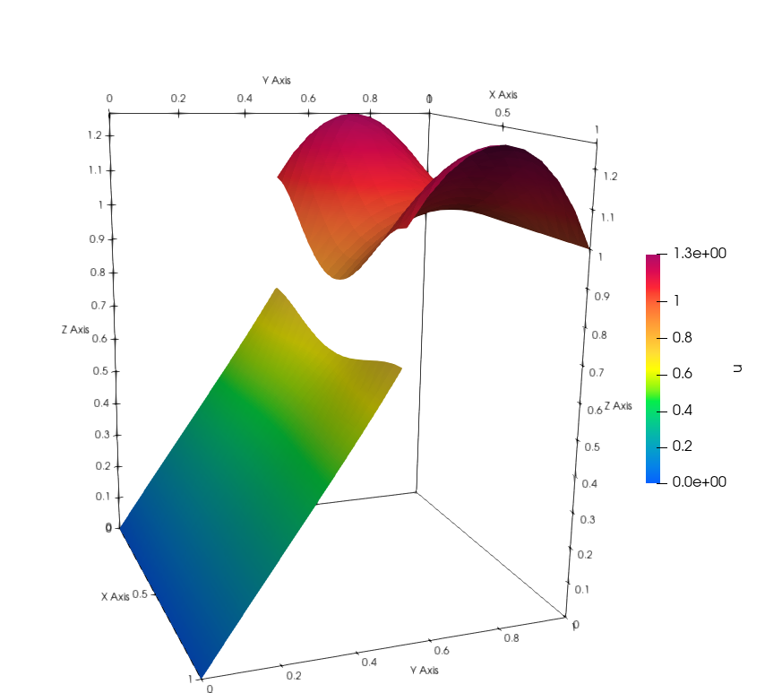

*******************************
Point-wise Dirichlet conditions
*******************************

Problem Description
###################

In some applications we would like to achive the Dirichlet boundary conditions
point-wisely. In the previous examples, we always satisfy the conditions weakly.
(For all test functions.) In this example we show, how to enforce a condition
to be sutisfied in all interface dofs.

Implementation
##################

The first part is the same as in the example Nonlinear Problem. 

Because the derivative does not make a clear sence we will demonstrate only
elgebraic type of conditions. The UFL notation is not suitable for point-wise
equalitym we need to define the conditions with more effort. We need to change
the Jacobian and the residuum in the Newton solver. In this example we will have
equation :math:`2u_0^2 - u_1 = 0`. For that reason we define a following class.

::

    class Discontinuity():

        def __init__(self):
            pass

        def jacobian(self, coordinates, x1, x2):
            return [4*x1[( )], -1]
        
        def residual(self, coordinates, x1, x2):
            return 2*x1[( )]*x1[( )] - x2[( )]

The class has to containt methods jacobian and residual named exactly like in 
the example. Ten we create list of Dirichlet interface conditions as follows.

::

    dirichlet_bcs = [
        (( ), Discontinuity(), bottom_sign)
    ]

The empty list denotes subspace of FunctionSpace. We deal only with scalar 
space, so label is empty list if we would have MixedFunctionSpace we would
denote (i, ) i-th subspace if it is scalar and (i, j) if i-th space is vectorial.
Then we formulate the UFL as we are used to and solve the equation. (Because
we deal with Dirichlet boundary conditions we need to include the interface
in zero_bcs)

::

    # ufl forms
    interface = interface(mesh, interface_func, val=1)
    dX = Measure("dx")(domain=mesh, subdomain_data= marker)

    n = Constant((0.,1.))
    Tn = inner(grad(u(bottom_sign)) ,n)
    a_interface = (
        inner(Tn,v(top_sign))*dS
    )

    a1 = inner(grad(v), grad( u ))*dX(1)
    a0 = inner(grad(v), grad( u ))*dX(0)

    f1 = Expression('-60*pow(x[0]-0.5, 2)-pow(x[1]-0.5, 2)', degree=2)
    l1 = f1*v*dX(1)
    a1 += l1

    f0 = Expression('-pow(x[0]-0.5, 2)-pow(x[1]-0.5, 2)', degree=2)
    l0 = f0*v*dX(0)
    a0 += l0

    # solve
    Solver = NonlinearInterfaceSolver(
        u, marker, interface, interface_value=1, cell_val=cell_val, params=None)

    Solver.solve(a0, a1, a_interface,
                bcs0=[bcb, bct], bcs1=[bct, bcb], bcs_zero0=[bcm], bcs_zero1=[],
                dirichlet_interface=dirichlet_bcs
    )

Follow the previous example to save the solution. 

Result
##############

In the following figure you can see the result.

