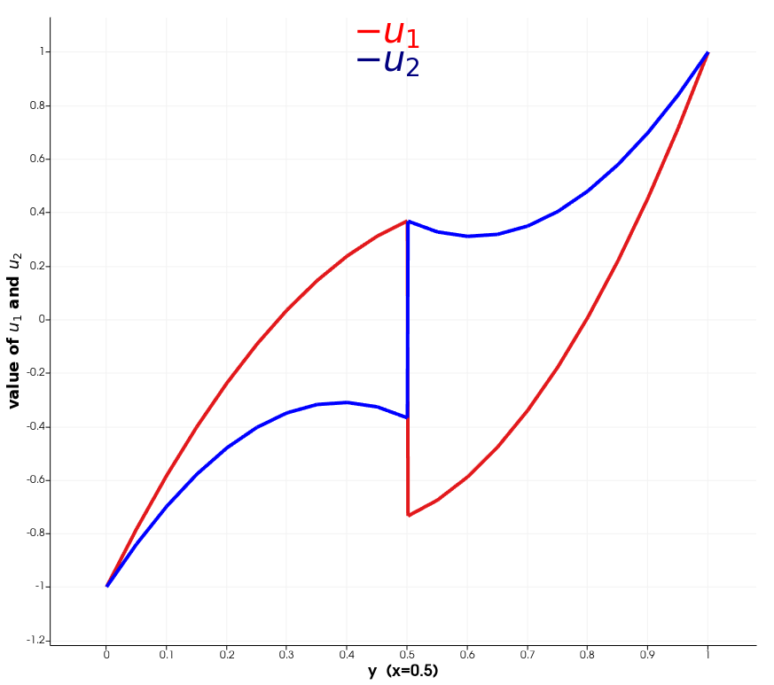

***************************************
Nonlinear Problem on MixedFunctionSpace
***************************************

Problem Description
###################

We will use the same mesh as before and simular equations, however we will use
MixedFunctionSpace to demonstrate a little bit more complex example.

Implementation
#################

We will build a MixedFunctionSpace.

::

    # function spaces
    E1 = FiniteElement("CG", mesh.ufl_cell(), 2)
    E2 = FiniteElement("CG", mesh.ufl_cell(), 2)

    V = FunctionSpace(mesh, MixedElement([E1, E2]))

    v = TestFunction(V)
    u = Function(V)
    (v1, v2) = split(v)
    (u1, u2) = split(u)

And we define the UFL forms.

::

    # ufl form
    interface = interface(mesh, interface_func, val=1)
    dX = Measure("dx")(domain=mesh, subdomain_data=marker)

    n = Constant((0.,1.))
    Tn1 = inner(grad(u1(top_sign)) ,n)

    a1_interface = (
        inner((u1(top_sign) - 2*u2(bottom_sign)), v1(top_sign))*dS
        - inner(Tn1, v1(bottom_sign))*dS
    )

    Tn2 = inner(grad(u2(top_sign)) ,n)

    a2_interface = (
        # inner((u2(top_sign) - u1(bottom_sign)), v2(top_sign))*dS
        - inner(Tn2, v2(bottom_sign))*dS
    )

    a_interface = a1_interface + a2_interface

    a1 = (
        inner(grad(v1), grad( u1))*dX(1)
        + inner(grad(v2), grad( u2))*dX(1)
        + exp(u1)*v1*dX(1)
    )

    a0 = (
        inner(grad(v1), grad(u1))*dX(0)
        + inner(grad(v2), grad(u2))*dX(0)
        + 2*exp(u1)*v1*dX(0)
    )

    f1 = Expression('exp(-(x[0]-0.5)*(x[0]-0.5)-(x[1]-0.5)*(x[1]-0.5) )', degree=2)
    l1 = 10.0*f1*v1*dX(1) + 10.0*f1*v2*dX(1) 
    a1 += l1

    f0 = Expression('exp(-(x[0]-0.5)*(x[0]-0.5)-(x[1]-0.5)*(x[1]-0.5) )', degree=2)
    l0 = -10.0*f0*v1*dX(0) -10.0*f0*v2*dX(0)
    a0 += l0

We will define one equation on the interface point-wisely. This will be the
equality :math:`u_1 = u_2`, ment as Dirichlet boundary condition :math:`u_2`
from top is equal :math:`u_1` from bottom.

::

    class Discontinuity():

        def __init__(self):
            pass

        def jacobian(self, coordinates, x1, x2):
            # first cell_val ... here bottom
            # [u1_bottom, u2_bottom, u1_top, u2_top]
            return [1, 0, 0, -1]
        
        def residual(self, coordinates, x1, x2):
            # x1 - on area cell_val
            # x2 - on the remaining part
            u2_top = x2[(1, )]
            u1_bottom = x1[(0, )]
            return  u1_bottom - u2_top

    dirichlet_bcs = [
        ((1, ), Discontinuity(), top_sign) # we will wtire it as dirichlet to u1 on top
    ]

Result
##############

In the following figure you can see the result along the line :math:`(0.5, y)`.

