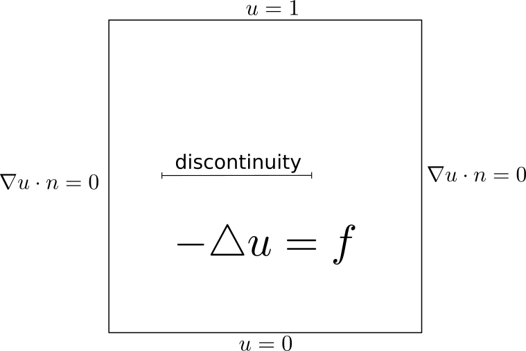
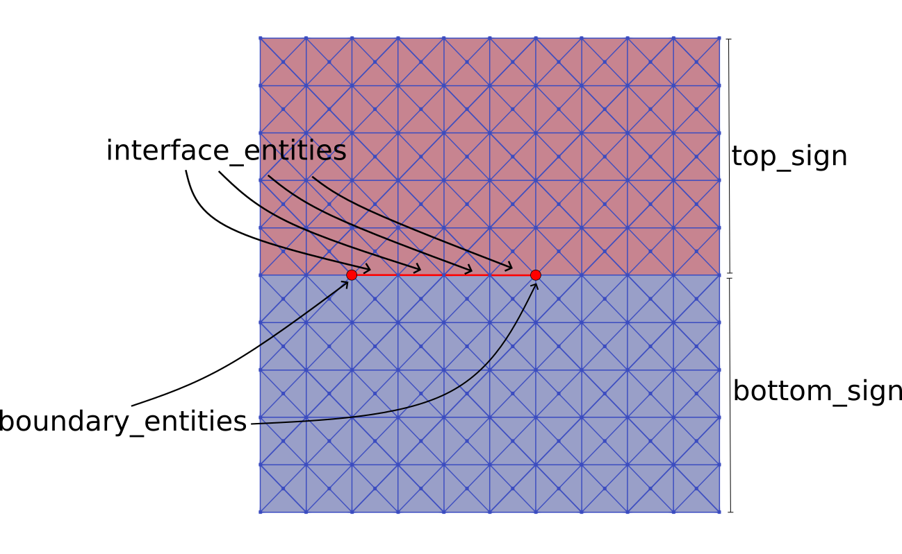

***************************************
Broken Laplace
***************************************

Problem Description
###################

In this example we will solve only one equation in the domain, but there will be
a disconinuity in the middle of the domain.

First we need to generate mesh which will be discontinuous along the discontinuity.
For that purous there is function `make_broken_mesh` and we can create the mesh
easily as it is implemented in `make_btoken_mesh.py`.
::

    comm = MPI.COMM_WORLD
    size = comm.Get_size()

    val = 1
    if size == 1:
        parameters["ghost_mode"] = "none"
        mesh = UnitSquareMesh(10, 10, "crossed")
        dim = mesh.topology().dim()
        interface = MeshFunction('size_t', mesh, dim - 1, 0)
        # label the interface edges
        for edge in entities(mesh, dim - 1):
            x = edge.midpoint().x()
            y = edge.midpoint().y()
            if y == 0.5 and 0.2 < x < 0.6:
                interface[edge] = val
        make_broken_mesh(mesh, interface, val, directory='./mesh/', name='broken_mesh')

The mesh is saved to 'mesh/broken_mesh.h5'. In this file is not only the mesh,
but also markers of edges and point, which are demonstrated below.

The mesh we will load in the main file `broken_laplace.py`.

::

    mesh = Mesh()
    with HDF5File(mesh.mpi_comm(), f"{directory + name}.h5", "r") as hdf:
        hdf.read(mesh, "/mesh", False)
        dim = mesh.topology().dim()
        interface_entities = MeshFunction('bool', mesh, dim - 1, False)
        boundary_entities = MeshFunction('bool', mesh, dim - 2, False)
        hdf.read(interface_entities, "/interface")
        hdf.read(boundary_entities, "/boundary")

We need to label cells form both sided from the discontinuity and label signs.

::

    marker = MeshFunction("size_t", mesh, mesh.topology().dim(), 0)
    for c in cells(mesh):
        if c.midpoint().y() > 0.5:
            marker[c] = 1

    cell_val = 0 # bottom
    top_sign = '-'
    bottom_sign = '+' # plus corresponds to the cell val

Then we create function space, functions, boundaries and forms as we are used to.

::

    V = FunctionSpace(mesh, 'CG', 2)
    u = Function(V)
    v = TestFunction(V)

    # boundary conditions
    top =  CompiledSubDomain("near(x[1], top) && on_boundary", top=1.0)
    bottom = CompiledSubDomain("near(x[1], bottom) && on_boundary", bottom=0.0)
    bcb = DirichletBC(V, Constant(0.0), bottom)
    bct = DirichletBC(V, Constant((1.0)), top)
    bcs = [bcb, bct]

    # ufl form
    a = inner(grad(u), grad(v))*dx
    f = Expression('exp(-(x[0]-0.5)*(x[0]-0.5)-(x[1]-0.5)*(x[1]-0.5) )', degree=2)
    l = -10*f*v*dx
    a += l

For the interface form we have here two examples. First the discontiuous one

::

    theta = 0.5
    a_interface = (
        - theta*inner(Tn, v(bottom_sign))*dS - 10*inner(f, v(bottom_sign))*dS
        + (1-theta)*inner((u(top_sign) - 1*u(bottom_sign)), v(bottom_sign))*dS
    )
    dirichlet_bcs=None

And then the continous with dirichlet interface conditions.

::

    a_interface = (
        - inner(Tn, v(bottom_sign))*dS - 10*inner(f, v(bottom_sign))*dS
    )
    class Continuity():

        def __init__(self):
            pass

        def jacobian(self, coordinates, x1, x2):
            return [1, -1]
        
        def residual(self, coordinates, x1, x2):
            return x1[( )] - x2[( )]

    dirichlet_bcs = [
        (( ), Continuity(), top_sign)
    ]

The empty tupe `( )` means that there is no subspace. If we would have 
VectorFunctionSpace or MixedFunctionSpace we will need to specify the subspace
by `(i, )` or `(i, j)`. Then we will create the solver and solve the problem.

::

    solver = NonlinearBrokenSolver(u, marker, interface_entities, boundary_entities,
        comm=None, interface_value=True, cell_val=cell_val, params=None, monitor=True
    )

    # solve
    solver.solve(a, a_interface, bcs=bcs, bcs_zero=None,
        dirichlet_interface=dirichlet_bcs
    )

